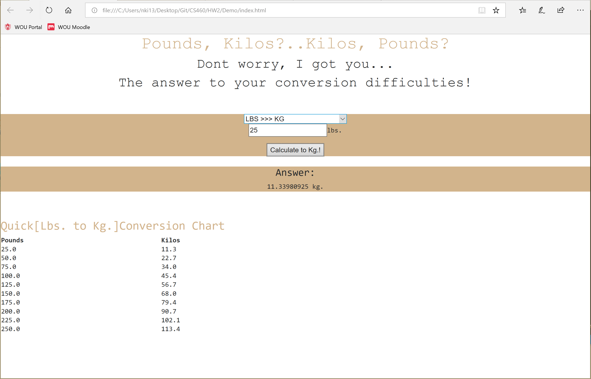

# Journal - Homework 2

For this homework I had to do some calculation using the user input, then return something by modifying elements and adding new ones. I also had to do all of my work on a branch in git, and then had to merge it back to master when I was finished.
I have never made a branch on git before so this was important for me to not mess up, considering the horror stories of what could go wrong. Also, I had never written anything in JavaScript before so I knew this would be interesting.

## Links

* [Portfolio Home Page](https://nki13.github.io)
* [Assignment Page](http://www.wou.edu/~morses/classes/cs46x/assignments/HW2.html)
* [Code Repository](https://github.com/nki13/nki13.github.io/tree/master/CS460/HW2)
* [Homework 2 Demo](https://nki13.github.io/CS460/HW2/Demo/)

## Step 1: Creating a branch

The first thing on the list to do was to create a branch in git, that I could do all my work for this homework on. To accomplish this I typed the following into Command Line: 

```bash
git branch hw2
git checkout hw2
```

## Step 2: Laying a foundation

My idea for this homework was to make a converter that would convert pounds to kilograms and vice versa. I wanted to keep it simple so that I could maximize my time by playing with what I could do. Rather than spending all my time trying to understand something that is beyond the complexity of this homework, or even worse getting it to work. Moving forward, I still wanted to make it "cool". To make things change, and to further add new things on the page, I added a table specific to which conversion the user chose. Here is the basic layout of my index.html page with some details of what content went where:

```html
<html>
<head>
    <title>Pound , Kilo Conversion</title>
    <!-- Bootstrap CSS -->
    <link rel="stylesheet" href="https://maxcdn.bootstrapcdn.com/bootstrap/4.0.0-alpha.6/css/bootstrap.min.css" integrity="sha384-rwoIResjU2yc3z8GV/NPeZWAv56rSmLldC3R/AZzGRnGxQQKnKkoFVhFQhNUwEyJ" crossorigin="anonymous">
    <link rel="stylesheet" type="text/css" href="styles.css"/>
    <!--JQuery then Bootstrap JS. -->
    <script src="https://maxcdn.bootstrapcdn.com/bootstrap/4.0.0-alpha.6/js/bootstrap.min.js" integrity="sha384-vBWWzlZJ8ea9aCX4pEW3rVHjgjt7zpkNpZk+02D9phzyeVkE+jo0ieGizqPLForn" crossorigin="anonymous"></script>
    <script src="https://ajax.googleapis.com/ajax/libs/jquery/3.2.1/jquery.min.js"></script>
</head>

<body>
     <div id="formstuff">
        <form>
            <select name="measurement">
                <option selected>choose ONE of the following...</option>
                <option id="kg" value="kg">LBS >>> KG</option>
                <option id="lbs" value="lbs">KG >>> LBS</option>
            </select>
                
            <!--Input for lbs to kg conversion-->
            <div id="input1">
                <input type="int" id="input01">lbs.</input>
            </div>
                 
            <!--Input for kg to lbs conversion-->
            <div id="input2">
                <input type="int" id="input02">kg.</input>
            </div>
        </form>
                
    <!--Buttons for each...needs to be separate from form(because not form element)-->
    <button id="button1">Calculate to Kg.!</button>
    <button id="button2">Calculate to Lbs.!</button>
    </div>

    <!--Place where the answer of the calculations will be appended to-->
    <div id="answer">
        <h4>Answer:</h4>
        <p id="answerbox">" "</p>
    </div>
    <br>
    <br>
    <!--Table element to show up after user clicks calculate button[kg to lbs]-->
    <div id="table1">
        <h3>Quick[Kg. to Lbs.]Conversion Chart</h3>
    </div>
    <div id="table2">
        <h3>Quick[Lbs. to Kg.]Conversion Chart</h3>
    </div>
    </body>
</html>
```
So shown above, I have all the elements I need to make this page work. Now, I just need to use JavaScript and JQuery to make them actually DO something.

## Step 3: Javascript & JQuery

To keep things as simple as possible, I decided to put my Javascript right into my index.html file. To accomplish this I put it all into a script element as shown <scirpt></script>. Shown below is what each button will "DO" everytime each one is clicked. There are always elements being hidden, new elements being shown, or something being emptied like an input box. You will notice down at the bottom of the script that there is some calculation being done for the answer box. There is where the calculation from the user input is converted into their desired measurement.

'''html
    <script>
        $(document).ready(function(){
            $("#kg").click(function(){
                $("#input2").hide();
                $("#button2").hide();
                $("#table1").hide();
                $("#answerbox").empty();
                $("#input1").show();
                $("#button1").show();
            });
            $("#lbs").click(function(){
                $("#input1").hide();
                $("#button1").hide();
                $("#table2").hide();
                $("#answerbox").empty();
                $("#input2").show();
                $("#button2").show();
            });
            $("#button1").click(function(){
                $("#table1").hide();
                $("#table2").show();
                $("#answer").show();
                $("#answerbox").empty();
                $("#answerbox").append($("#input01").val() * 0.45359237 + " kg. <br>");
            });
            $("#button2").click(function(){
                $("#table2").hide();
                $("#table1").show();
                $("#answer").show();
                $("#answerbox").empty();
                $("#answerbox").append($("#input02").val() / 0.45359237 + " lbs. <br>");
            });
        });
    </script>
'''

## Step 4: Wrapping it up

To wrap everything up I made a styles.css file to style my converter to how I wanted it. Thus far, I only needed two files to accomplish this homework, which were index.html and styles.css. Here is how I styled my page:

```CSS
#pageheader {
	text-align: center;
	font-family: "Courier", monospace;
}

h1 {
	color: tan;
}

#formstuff {
	text-align: center;
	font-family: "Courer", monospace;
	background-color: tan;
}

#answer {
	text-align: center;
	font-family: "Courer", monospace;
	background-color: tan;
}

#table1 {
	font-family: "Courer", monospace;
}

#table2 {
	font-family: "Courer", monospace;
}

h3 {
	color: tan;
}
```
Here is what my final converter page looked like after doing a simple conversion:



Overall, I liked how my converter came out. I think little by little I am preparing and changing myself to make things that are appealing to the real world. I think taking the time to experiment with these tools is really helping me learn hands-on how useful they can be to me, rather than just being lectured what they can do. Since my converter page was done to my liking, I felt ready to merge my hw2 branch back to master before calling it a day.

## Step 5: Merging hw2 branch back to master

Lastly, I had to merge the branch I had been working on back on to the master branch. Before doing so I made a simple change to my README file on the master branch to advance it. Then here is how I merged my hw2 branch to master:

```bash
git commit -m "Edited README file to advance master"
git merge master hw2
git push origin master
```