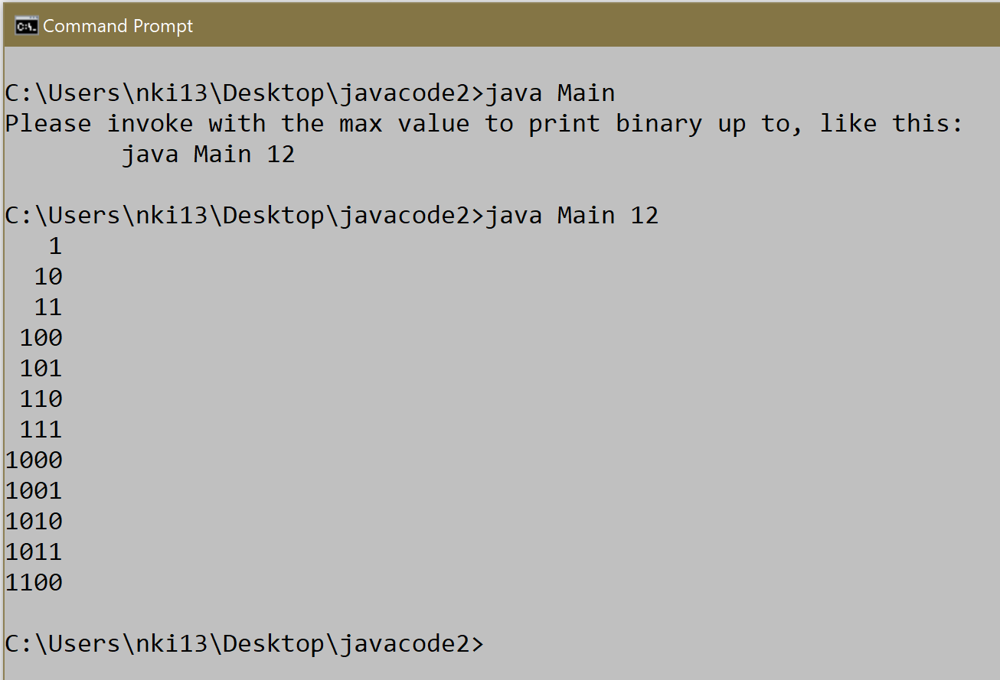
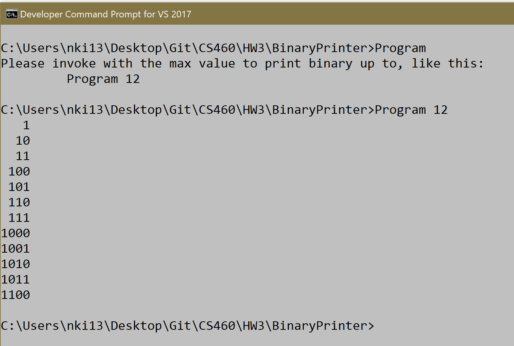
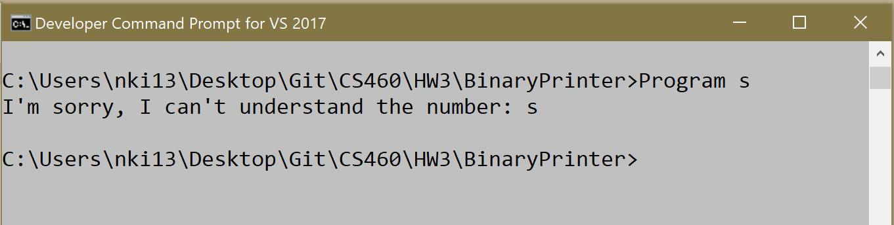
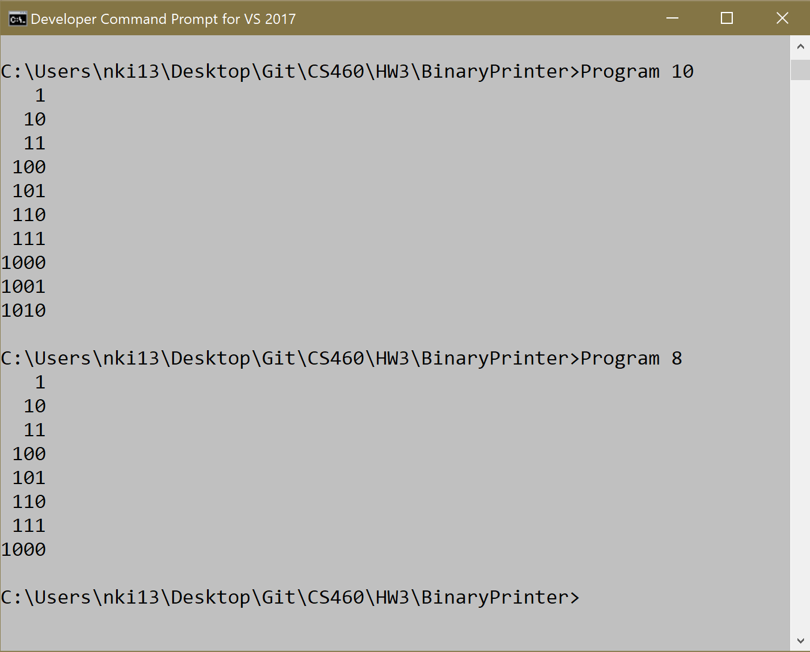
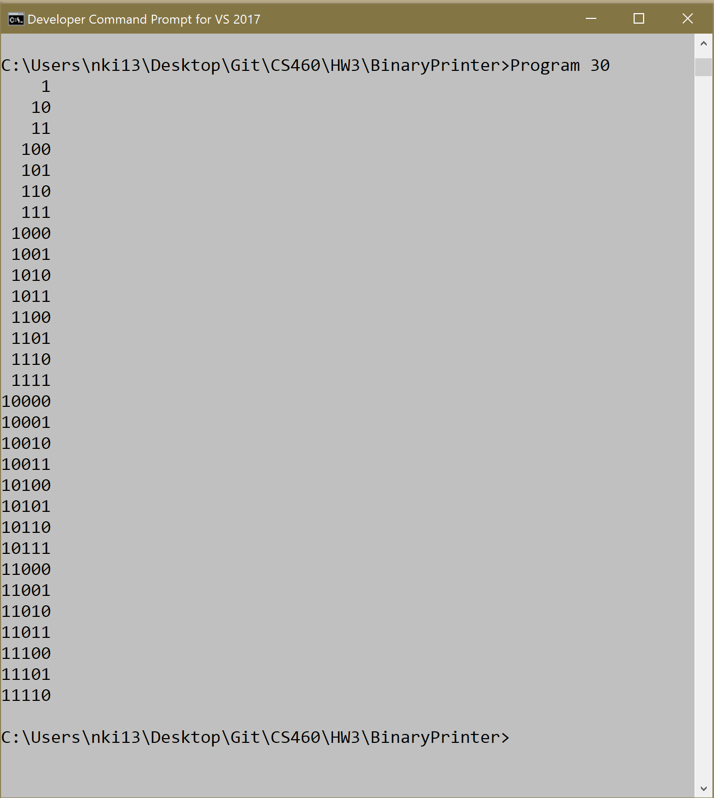

# Journal - Homework 3

For this homework I had to use Visual Studio IDE to write a C# console application. I was given a Java application that printed out the binary value of 1 through 'n', where 'n' was the user input. My job was to translate this Java app into C#, and have it working the same way.
I had never written in C# before, but the translation seemed pretty straight forward. I pulled up the C# documentation up and decided to dive in.

## Links

* [Portfolio Home Page](https://nki13.github.io)
* [Assignment Page](http://www.wou.edu/~morses/classes/cs46x/assignments/HW3_1819.html)
* [Code Repository](https://github.com/nki13/nki13.github.io/tree/master/CS460/HW3)

## Step 1: Creating a branch

Just like the previous homework, we had to do our work for this C# console application on a branch in git. I decided to name this branch 'hw3'.
```bash
git branch hw3
git checkout hw3
```

## Step 2: Translate Node

This class was very straight forward to translate, thanks to Dr. Morse for giving a suggested list to follow while translating. In this journal I show me following that order through my translations. Here is my C# code for my node class:
```c#
class Node<T>
{
    // data of node
    public T data;
    // node after current node
    public Node<T> next;
    public Node(T data, Node<T> next)
    {
        this.data = data;
        this.next = next;
    }
}
```

## Step 3: Translate IQueue

Going forth, I had the option to make seperate .cs files for each class or to keep them in the same Program.cs file, and then create seperate classes within the same namespace. I chose to stick with my one Program.cs, and named my namespace 'BinaryPrinter'. From there, the next thing to translate was the interface. C# interfaces begin with an 'I', so I named my interface IQueue. Just like the Node class, this interface was fairly straight forward. Here is my C# code for that interface:
```c#
interface IQueue<T>
{
    T Push(T element);

    T Pop();

    bool IsEmpty();
}
```

## Step 4: Translate QueueUnderflowException

This exception class was fairly straight forward to translate. I must say that super() in Java relates to base() in C#. Shown in my code below, you can see where I had to translate minor changes:
```c#
    class QueueUnderflowException : Exception
    {
        public QueueUnderflowException() : base() { }

        public QueueUnderflowException(string message) : base(message) { }
    }
```

## Step 5: Translate LinkedQueue

This was one of the first bulkier classes that I had to translate. It implemented the methods declared in the IQueue interface, which were Pop(), Push(), and IsEmpty(). I had to make a minor change from Java's NullPointerException into C#'s NullReferenceException as shown below. Here is the C# code for the LinkedQueue class:
```c#
class LinkedQueue<T> : IQueue<T>
{
    private Node<T> front;
    private Node<T> rear;
    public LinkedQueue()
    {
        front = null;
        rear = null;
    }
    public T Push(T element)
    {
        if (element == null )
        {
            throw new NullReferenceException();
        }

        if ( IsEmpty() )
        {
            Node<T> tmp = new Node<T>(element, null);
            rear = front = tmp;
        }
        else
        {
            Node<T> tmp = new Node<T>(element, null);
            rear.next = tmp;
            rear = tmp;
        }
        return element;
    }
    public T Pop()
    {
        T tmp;
        if ( IsEmpty() )
        {
            throw new QueueUnderflowException("The queue was empty when pop was invoked");
        }
        else if ( front == rear)
        {
            tmp = front.data;
            front = null;
            rear = null;
        }
        else
        {
            tmp = front.data;
            front = front.next;
        }
        return tmp;
    }
    public bool IsEmpty()
    {
        if (front == null && rear == null )
        {
           return true;
        }
        else
        {
           return false;
        }
    }
}
```

## Step 6: Translate Program (Main)

Thankfully this was the last class to translate, and of course it would come with its share of complications. This class had two methods one named generateBinaryRepresentationList() and main(). 
When translating there were minor differences between the languages. For example the add() method in Java for LinkedLists is different from C#'s addFirst() and addLast() methods. Another example of some differences were when assigning a value to maxLength. C#'s LinkedList has different methods to call when getting that value, which is shown in code below. Another small but important difference is when printing something to the console. C# uses Console.WriteLine() rather than Java's System.out.println().
When I was done translating, I ran into an unhandled exception error in the terminal after running. I realized that I had to put a try-catch block into my main method when trying to call on the generateBinaryRepresentationList().
Here is the code for my C# Program class:
```c#
class Program
{
    static LinkedList<String> generateBinaryRepresentationList(int n)
    {
        LinkedQueue<StringBuilder> q = new LinkedQueue<StringBuilder>();
        LinkedList<String> output = new LinkedList<String>();
        if (n <= 1)
        {
            output.AddFirst(n.ToString());
            return output;
        }
        q.Push(new StringBuilder("1"));
        while(n-- > 0)
        {
            StringBuilder sb = q.Pop();
            output.AddLast(sb.ToString());
            StringBuilder sbc = new StringBuilder(sb.ToString());
            sb.Append('0');
            q.Push(sb);
            sbc.Append('1');
            q.Push(sbc);
        }
        return output;
    }
    static void Main(string[] args)
    {
        int n = 10;
        if(args.Length < 1)
        {
            Console.WriteLine("Please invoke with the max value to print binary up to, like this:");
            Console.WriteLine("\t Program 12");
            return;
        }
        try
        {
            n = int.Parse(args[0]);
        }
        catch (FormatException)
        {
            Console.WriteLine("I'm sorry, I can't understand the number: " + args[0]);
            return;
        }
        LinkedList<string> output = new LinkedList<string>();
        try
        {
            output = generateBinaryRepresentationList(n);
        }
        catch (QueueUnderflowException e)
        {
            Console.WriteLine(e.GetBaseException().Message);
            return;
        }
        catch (NullReferenceException e)
        {
            Console.WriteLine(e);
            return;
        }
        int maxLength = output.Last.Value.Length;
        foreach (String s in output)
        {
            for (int i = 0;i < maxLength - s.Length; i++)
            {
                Console.Write(" ");
            }
            Console.WriteLine(s);
        }
    }
}
```

## Step 7: XML Comments and Creating a .gitignore

I have never written XML Comments before, but it was fairly simple and easy to understand. I added XML Comments to every every class, and every method within those classes. Here is an example of what the XML comments looked like for my Push() method in the LinkedQueue class:
```c#
/// <summary>
/// Pushes node onto queue
/// </summary>
/// <param name="element"></param>
/// <returns>
/// enqueued element
/// </returns>
``` 

Creating a .gitignore file was farily simple. I googled some examples and then used file and folder names from my own local repo. Here is what my .gitignore file looked like:
```txt
# Don't track content of these folders
CS460/HW3/.vs/
CS460/HW3/BinaryPrinter/.vs/
CS460/HW3/BinaryPrinter/bin/
CS460/HW3/BinaryPrinter/obj/

# Compiled source #
###################
*.exe
```

## Thank God, Running!

Overall, this homework was straight forward and simple to follow. I, of course, ran into some complications but they were mostly self inflicted. Like missing a '/' or forgetting to assign something back to another something in an if statement. Using the Visual Studio IDE helped alot as well. I compiled and ran my Program and here is what I got!

Here is a comparison of outputs with the Java program and outputs with my C# console application. The Java application is the top picture and the C# is the picture right below it.



Here is the application throwing an error if you put in a char:


Here is the application running with random numbers:


This picture shows how what is printed is being right justified:


The last thing for me to do was to merge my hw3 branch back to master. And I did it the same way as I did in Homework 2. I checkedout and advanced master by making a change to the index.md file, then I merged hw3 back to it by doing:
```bash
git merge hw3 master
```