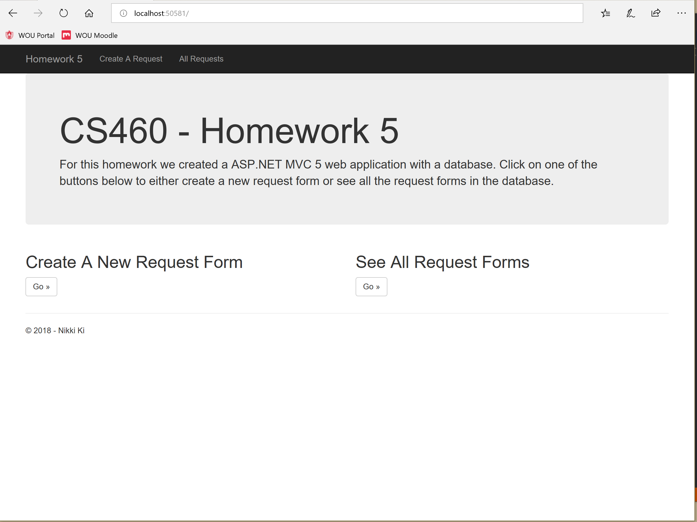
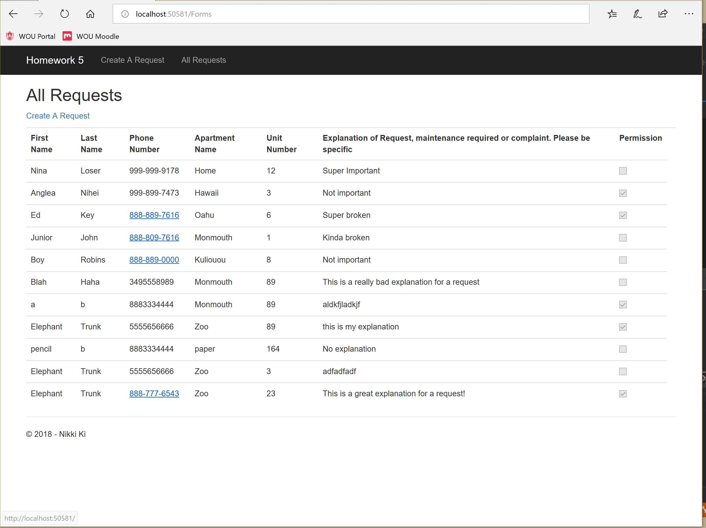
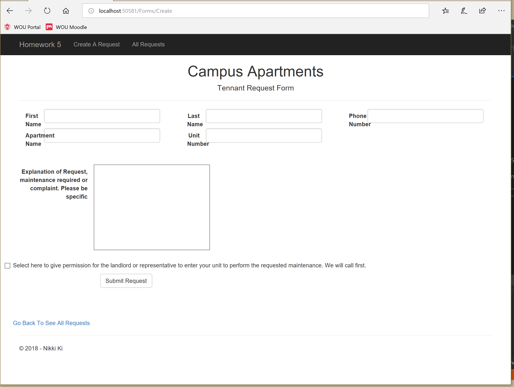
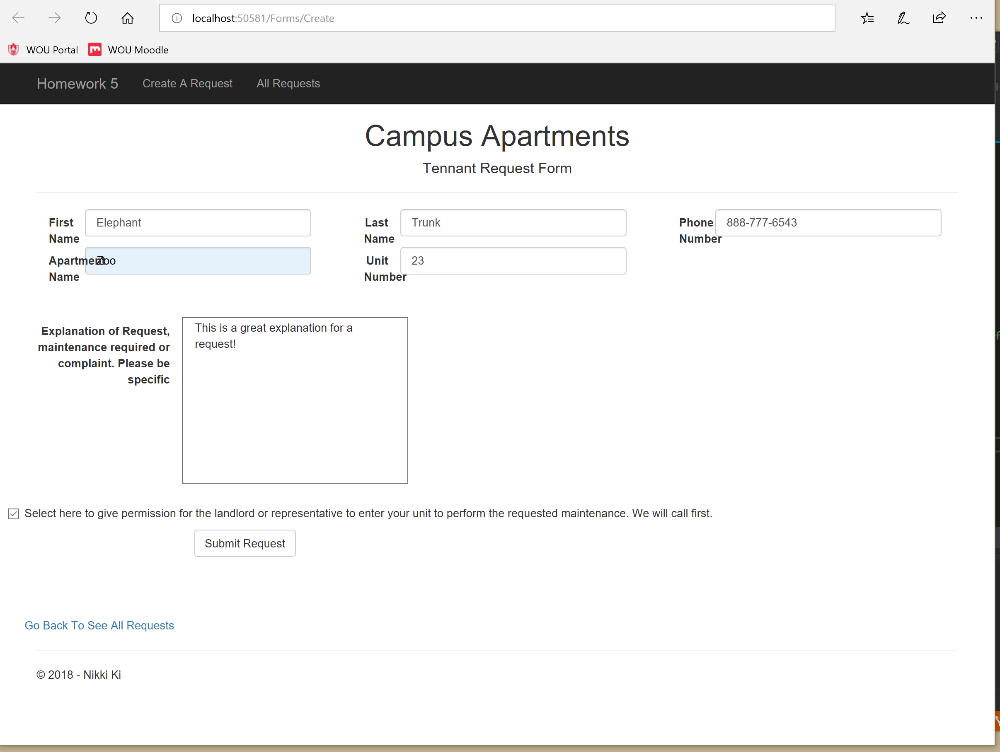
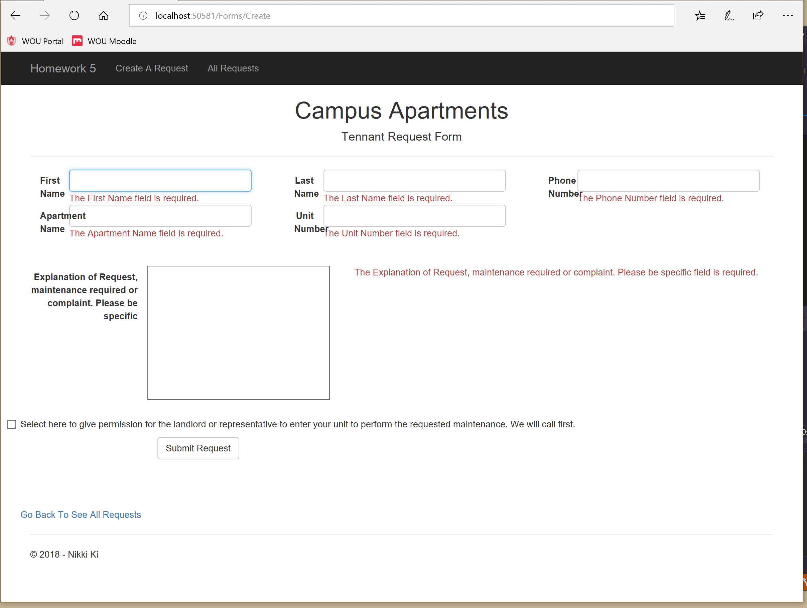

# Journal - Homework 5

For this homework, building off of what I learned in the last homework, I had to create another ASP.NET MVC 5 web application. This time, the web application would use a simple one-table local database. The content for this homework was making a maintenance or service request form, and saving the service requests to a database.
I have never used a database when writing a web application, so I knew this would be interesting. But following along with Dr. Morse in class and taking good notes on steps to follow really helped me out.

## Links:

* [Portfolio Home Page](https://nki13.github.io)
* [Assignment Page](http://www.wou.edu/~morses/classes/cs46x/assignments/HW5_1819.html)
* [Code Repository](https://github.com/nki13/nki13.github.io/tree/master/CS460/HW5)

## Step 1: Setting up

I started with an empty MVC project in Visual Studio. I decided to start with the index landing page for the homework web application, and made it look decent. I breifly explained what this homework was about and made links to both pages I will create later in this homework. Here is what that landing page looks like:


## Step 2: Creating the Database and populating it

The next thing to tackle was the database. I created the database by adding a new SQL Server database item into the App_Data folder. The actual database is a .mdf file which I named Forms.mdf. Once the database was created, the next thing to do was populate it. I did this by creating a new query that I named up.sql. Here is what that up.sql query looks like:
```SQL
CREATE TABLE [dbo].[Forms]
(
	[ID]			INT IDENTITY (1,1)	NOT NULL,
	[FirstName]		NVARCHAR(64)		NOT NULL,
	[LastName]		NVARCHAR(64)		NOT NULL,
	[Phone]			NVARCHAR(64)		NOT NULL,
	[ApartmentName]	NVARCHAR(64)		NOT NULL,
	[UnitNumber]	INT					NOT NULL,
	[Explanation]	VARCHAR(364)		NOT NULL,
	[Permission]	BIT					NOT NULL,
	CONSTRAINT [PK_dbo.Forms] PRIMARY KEY CLUSTERED ([ID] ASC)
);

INSERT INTO [dbo].[Forms] (FirstName, LastName, Phone, ApartmentName, UnitNumber, Explanation, Permission) VALUES
	('Nina', 'Loser', '999-999-9178', 'Home', 12, 'Super Important', 0),
	('Anglea', 'Nihei', '999-899-7473', 'Hawaii', 3, 'Not important', 1),
	('Ed', 'Key', '888-889-7616', 'Oahu', 6, 'Super broken', 1),
	('Junior', 'John', '888-809-7616', 'Monmouth', 1, 'Kinda broken', 0),
	('Boy', 'Robins', '888-889-0000', 'Kuliouou', 8, 'Not important', 0)
GO
```
Corresponding to that up.sql query, I also needed to create a down.sql query to drop that table from the database. This is what that down.sql query file looks like:
```SQL
DROP TABLE dbo.Forms
```
Great! I have a database and I can put things into it. Now I have to be able to use it with this web app.

## Step 3: Creating a Model and Data Abstraction Layer(DAL) to match

To be able to use this database with this web application the first thing I needed to do was create a Model. I did this by adding a new file to the Models folder, I named it Forms.cs. In class, I learned that models have attributes and I had to create attributes matching the database in this file. Here is what my Forms Model class looks like:
```cs
namespace HW5.Models
{
    public class Form
    {
        [Key]
        public int ID { get; set; }

        [Required]
        [Display(Name = "First Name")]
        //label for uses this
        public string FirstName { get; set; }

        [Required]
        [Display(Name = "Last Name")]
        public string LastName { get; set; }

        [Required, Phone, Display(Name = "Phone Number")]
        public string Phone { get; set; }

        [Required, Display(Name = "Apartment Name")]
        public string ApartmentName { get; set; }

        [Required, Display(Name = "Unit Number")]
        public int UnitNumber { get; set; }

        [Required]
        public string Explanation { get; set; }

        public bool Permission { get; set; }
    }
}
```
After creating the Model, I had to create a Data Abstraction Layer to access the database safely. I did this by created a new folder within the project and named it DAL. In that DAL folder I created a new file and named it FormsContext.cs. As seen below this class implements DbContext which is what does the magic of talking to and altering the database. We can use DbContext by using System.Data.Entity as shown below. Here is what my FormsContext looks like:
```cs
using System.Data.Entity;
namespace HW5.DAL
{
    public class FormsContext : DbContext 
    {
        public FormsContext() : base("name=Forms")
        {

        }

        public virtual DbSet<Form> Forms { get; set; }
    }
}
```
## Step 4: Connecting the two

Now that I have both a database and model created, I needed to connect the two. I did this by adding a connection strings section to my web.config file. I retrieved the connection string to my database by right clicking on it in visual studio and clicking properties. From there I copied and pasted that connection string in my web.config file. Here is what I added to my web.config file to make that connection:
```cs
  <connectionStrings>
	<add name="Forms" connectionString="Data Source=(LocalDB)\MSSQLLocalDB;AttachDbFilename=C:\Users\nki13\Desktop\Git\CS460\HW5\HW5\App_Data\Forms.mdf;Integrated Security=True" providerName="System.Data.SqlClient" />
  </connectionStrings>
```

## Step 5: Scaffolding a Controller & Views, Making them my own

Just for this homework and learning purposes, I scaffolded a FormsController.cs class and Views for that Controller based off of what I had just created. As Dr. Morse had said in class, this isnt the best way to do this because we want to be able to go beyond what scaffolding does, but just for this homework we could test it out and see what it would give us.
Going through what scaffolding created, it definetely needed some re-arranging and editing in some areas. I started off with looking through all the Http GET and POST methods that it had created in the FormsController. I deleted some that I didn't need, and kept the ones I did. The ones that I absolutely needed for this homework were GET Index(), GET Create(), and POST Create(). Here is what my FormsController.cs file looks like after scaffolding and editing what was given:
```cs
namespace HW5.Controllers
{
    public class FormsController : Controller
    {
        private FormsContext db = new FormsContext();

        // GET: Forms
        public ActionResult Index()
        {
            return View(db.Forms.ToList());
        }

        // GET: Forms/Create
        public ActionResult Create()
        {
            return View();
        }

        // POST: Forms/Create
        // To protect from overposting attacks, please enable the specific properties you want to bind to, for 
        // more details see https://go.microsoft.com/fwlink/?LinkId=317598.
        [HttpPost]
        [ValidateAntiForgeryToken]
        public ActionResult Create([Bind(Include = "ID,FirstName,LastName,Phone,ApartmentName,UnitNumber,Explanation,Permission")] Form form)
        {
            if (ModelState.IsValid)
            {
                db.Forms.Add(form);
                db.SaveChanges();
                return RedirectToAction("Index");
            }

            return View(form);
        }
    }
}
```
Next, I knew I would have to make substantial edits to the Create.cshtml file. I looked at what the auto generated page looked like then altered it to look how I wanted it to. I mostly did some moving around here and there, creating new divs for columns and rows. One thing that I did make the most changes to was the textarea for the details of the request form. Here is what my Creat.cshtml file looks like:
```html
<center>
    <h1>Campus Apartments</h1>
    <h4>Tennant Request Form</h4>
</center>
@using (Html.BeginForm())
{
    <div class="form-horizontal">
        <hr />
        @Html.ValidationSummary(true, "", new { @class = "text-danger" })

        <div class="row">
            <div class="col-md-4">
                @Html.LabelFor(model => model.FirstName, htmlAttributes: new { @class = "control-label col-md-2" })
                @Html.EditorFor(model => model.FirstName, new { htmlAttributes = new { @class = "form-control" } })
                @Html.ValidationMessageFor(model => model.FirstName, "", new { @class = "text-danger" })
            </div>
            <div class="col-md-4">
                @Html.LabelFor(model => model.LastName, htmlAttributes: new { @class = "control-label col-md-2" })
                @Html.EditorFor(model => model.LastName, new { htmlAttributes = new { @class = "form-control" } })
                @Html.ValidationMessageFor(model => model.LastName, "", new { @class = "text-danger" })
            </div>
            <div class="col-md-4">
                @Html.LabelFor(model => model.Phone, htmlAttributes: new { @class = "control-label col-md-2" })
                @Html.EditorFor(model => model.Phone, new { htmlAttributes = new { @class = "form-control" } })
                @Html.ValidationMessageFor(model => model.Phone, "", new { @class = "text-danger" })
            </div>
        </div>
        <div class="row">
            <div class="col-md-4">
                @Html.LabelFor(model => model.ApartmentName, htmlAttributes: new { @class = "control-label col-md-2" })
                @Html.EditorFor(model => model.ApartmentName, new { htmlAttributes = new { @class = "form-control" } })
                @Html.ValidationMessageFor(model => model.ApartmentName, "", new { @class = "text-danger" })
            </div>
            <div class="col-md-4">
                @Html.LabelFor(model => model.UnitNumber, htmlAttributes: new { @class = "control-label col-md-2" })
                @Html.EditorFor(model => model.UnitNumber, new { htmlAttributes = new { @class = "form-control" } })
                @Html.ValidationMessageFor(model => model.UnitNumber, "", new { @class = "text-danger" })
            </div>
        </div>    
        <center>
        <div class="row">
            @* @Html.EditorFor(model => model.Explanation, new { htmlAttributes = new { @class = "form-control", @rows = 15, @cols=50} }) *@
            @*@Html.ValidationMessageFor(model => model.Explanation, "", new { @class = "text-danger" }) *@
            @* @Html.TextArea("details", "Explanation of request, maintenance required or complaint. Please be specific.", 15, 30, new { @class = "form-control", style = " rows=20, columns=100" }) *@
            @Html.TextAreaFor(model => model.Explanation, new { rows = 10, columns = 20 })
            @Html.ValidationMessageFor(model => model.Explanation, "", new { @class = "text-danger"})
        </div>
        </center>
        <div class="col-md-4">
            @*@Html.LabelFor(model => model.Permission, htmlAttributes: new { @class = "control-label col-md-2" })*@
            <div class="checkbox">
                @Html.EditorFor(model => model.Permission)
                @Html.ValidationMessageFor(model => model.Permission, "", new { @class = "text-danger" })
                <p>Select here to give permission for the landlord or representative to enter your unit to perform the requested maintenance. We will call first.</p>
            </div>
        </div>
        <div class="form-group">
            <div class="col-md-offset-2 col-md-10">
                <input type="submit" value="Submit Request" class="btn btn-default" />
            </div>
        </div>
    </div>
}
<div class="row">
    @Html.ActionLink("Go Back To See All Requests", "Index")
</div>
```
Lastly, I made some edits to the Index.cshtml for the Forms Controller deleting the things I no longer needed like the edit, details, and delete. These were very minor changes compared to the Create file.

## Results: Running!

And there we have it! It is running! Overall, I found this homework to be a little bit easier than the last. I think this is because Dr. Morse had went though a great example in class, giving me awesome steps or a direction to follow. What also helped me understand what I was actually doing was through the problems we ran into in class. For example I saw how the web application would have functioned without the database, and now how we can use a database for our advantage. Furhtermore, I am glad with how this homework turned out. I am also excited (and scared) to see what we will create next. Enough of my thoughts...here are some screenshots of the web application in action.

So here is my landing page for this homework that I created as I showed earlier. Again, the links work to both pages of this web application, which are to create a request and to see all the requests:


When clicking on the See All Request Forms link it takes you to this page with all of the current requests in the database. As you can see there is a link to create a new request form or the navigation bar will work too:


When clicking on the Create A New Request link button, it takes you to this form I created. Yes, I know it's not as pleasing to the eye, but I tried to make it look as decent as I could and focused more on the funtionality:


Here is an example of valid input for a request form:


After clicking the Submit Request button it takes you back to the see all requests page, and from there you can see that your request was successful added and saved to the database. This is my best effort at circling the request we added:


As always, if the input boxes are empty it will give the user this error:


