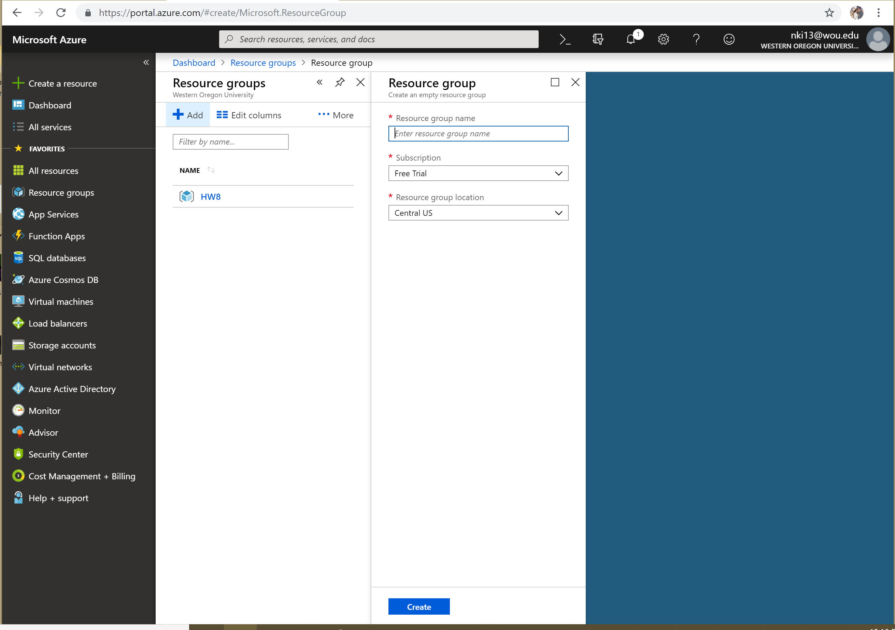
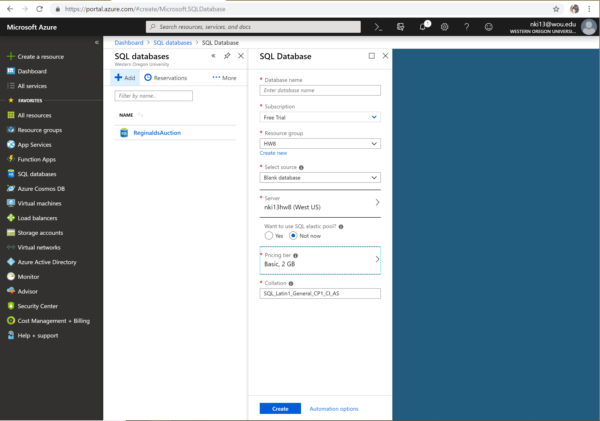
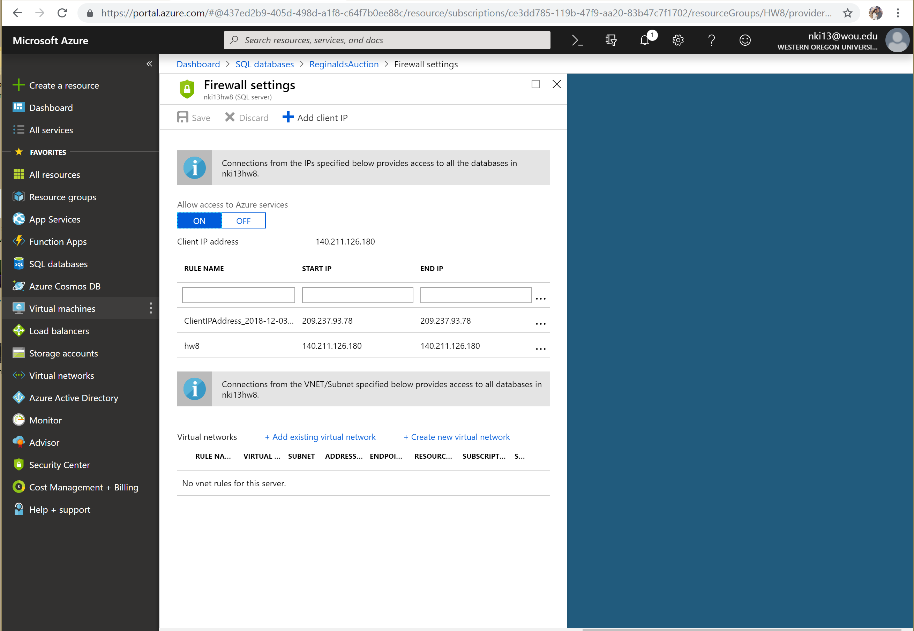
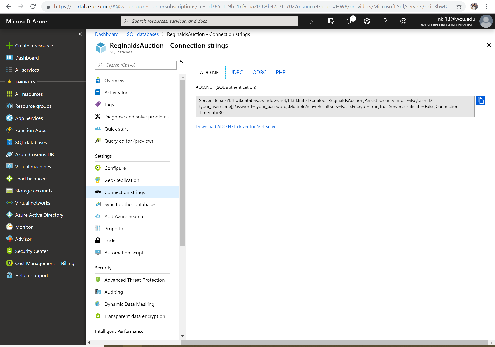
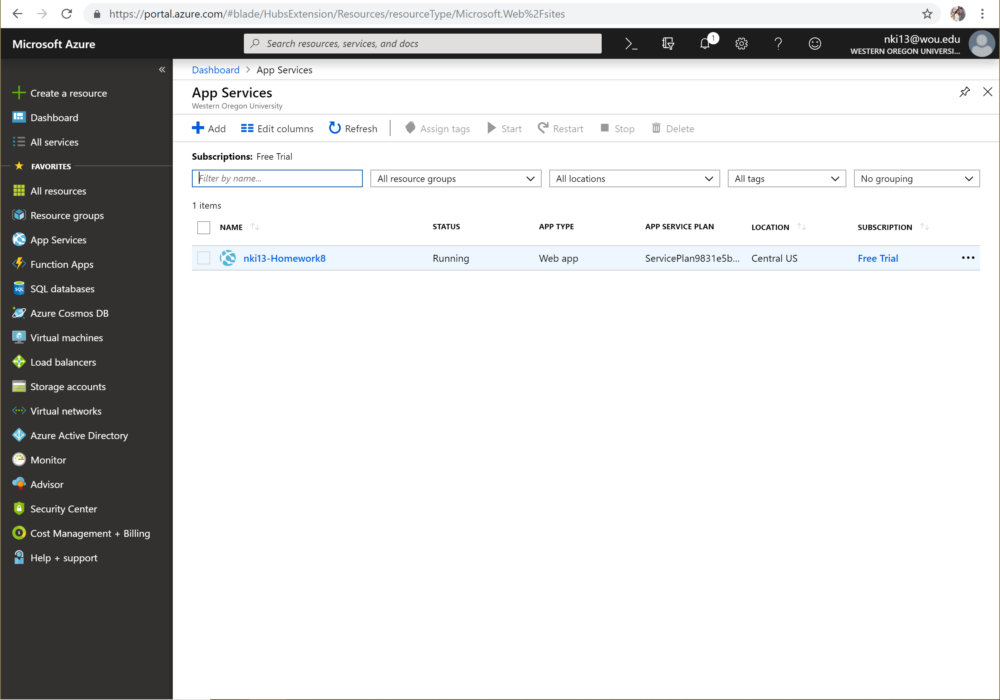
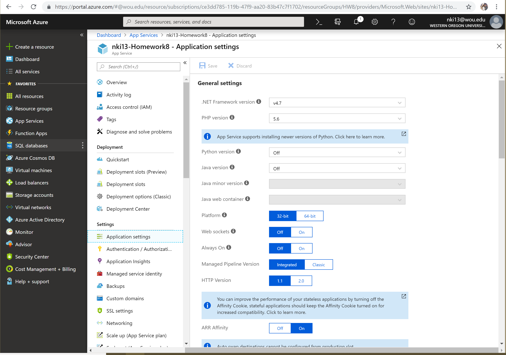
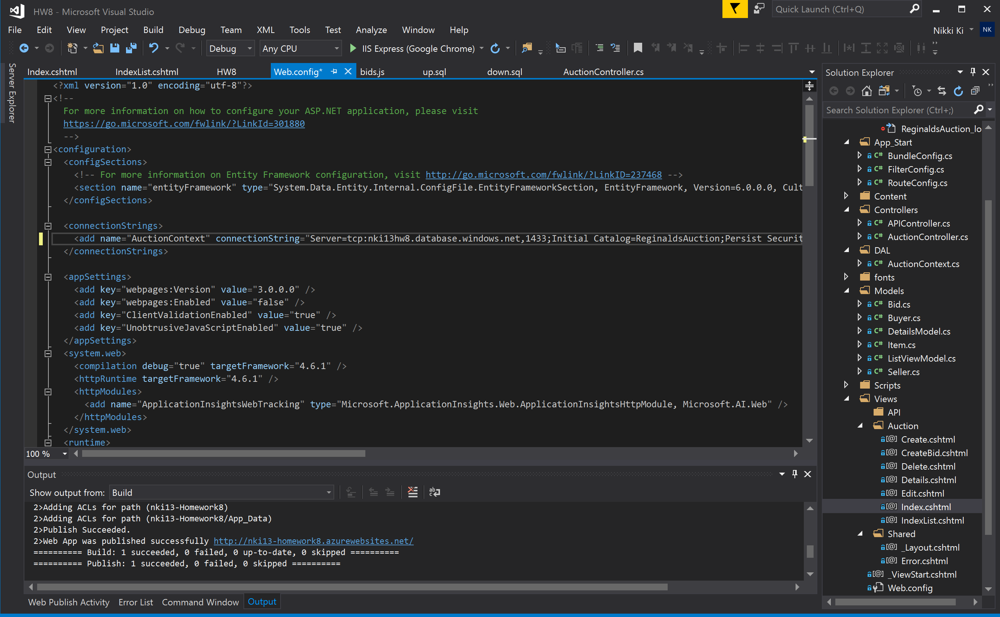
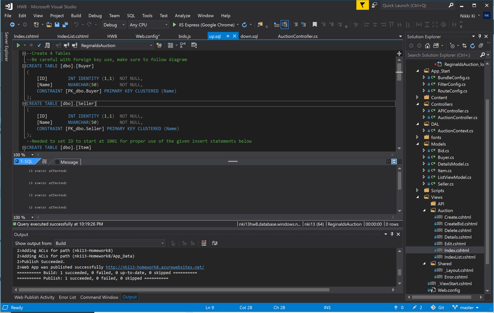
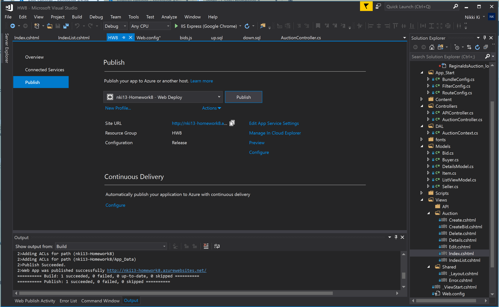
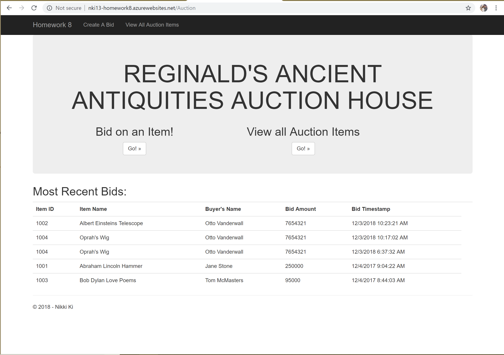

# Journal - Homework 9

For this homework I had to take the previous homework and deploy it to the Azure cloud. Here are the detailed steps I took to do so...

## Links:

* [Portfolio Home Page](https://nki13.github.io)
* [Assignment Page](http://www.wou.edu/~morses/classes/cs46x/assignments/HW9_1819.html)
* [Code Repository](https://github.com/nki13/nki13.github.io/tree/master/CS460/HW9)
* [Azure Link](http://nki13-homework8.azurewebsites.net/Auction)

### Step 1: Create a Resource Group
Create a Resource Group on Azure

### Step 2: Create a SQL Database
Create an SQL Database on Azure, this is where you make the user and password...

After the Database is made, set the Firewall.

Copy the connection string

### Step 4: Create an App Service
Create a Web App Service on Azure

Then go to App Services again, and then go to App Settings.

### Step 5: Set connection in Visual Studio
Add connection string to Visual Studio

Configure up and down sql files to interact with Azure database

### Step 6: Publish from Visual Studio
Go to Build, then Publish the MVC App from Visual Studio

Once deployed, it will open up and have a url like so...

Here is a link to visit that deployed web service...
*[Homework 9 Azure Link](http://nki13-homework8.azurewebsites.net/Auction)
